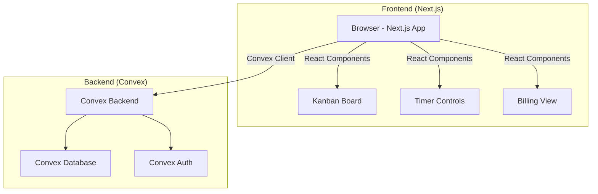
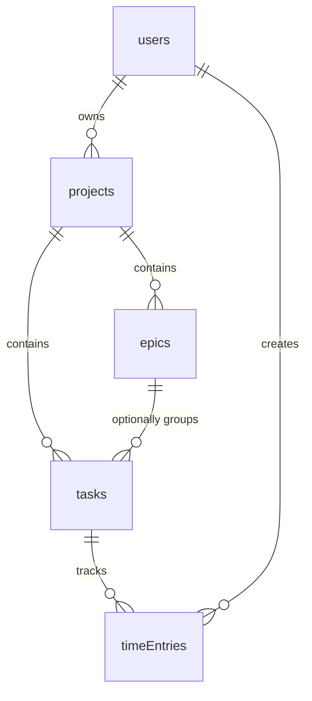

# Velo — Product Requirements Document (PRD)

## 1. Overview

**Product Name:** Velo
**One-Liner:** Projektmanagement mit integriertem Time-Tracking und Abrechnung — ohne Bloat, für Freelancer.
**Objective:** Build a fast, focused project management tool that combines Kanban boards, time tracking, and billing summaries for freelancers who need to manage client work and bill accurately.
**Differentiation:** Built for freelancers, not enterprises. No feature bloat, no per-seat pricing — just the essentials done well.
**Magic Moments:**
1. Timer starts automatically when a task moves to "In Progress" on the Kanban board.
2. End-of-month billing summary shows a clean breakdown of hours per client with one click.

**Success Criteria:**
- Daily use as the primary project management tool
- 90%+ of tasks have tracked time entries
- Month-end billing takes under 5 minutes
- All primary views load in under 200ms

---

## 2. Technical Architecture

### Architecture Overview



### Stack Table

| Layer | Technology | Purpose |
|-------|-----------|---------|
| Frontend | Next.js (React) | UI framework, routing, SSR |
| Styling | Tailwind CSS | Utility-first CSS |
| Drag & Drop | @hello-pangea/dnd | Kanban board drag & drop |
| Backend | Convex | Serverless functions, realtime subscriptions |
| Database | Convex (integrated) | Document database with reactive queries |
| Auth | Convex Auth | Authentication and session management |
| Icons | Lucide React | Icon set |
| Fonts | Inter, JetBrains Mono | Typography (via next/font or Google Fonts) |
| Date handling | date-fns | Date formatting and manipulation |
| CSV Export | papaparse | CSV generation for billing export |

### Repository Structure

```
velo/
├── convex/
│   ├── _generated/         # Auto-generated Convex files
│   ├── auth.ts             # Convex Auth configuration
│   ├── schema.ts           # Database schema definition
│   ├── projects.ts         # Project mutations & queries
│   ├── epics.ts            # Epic mutations & queries
│   ├── tasks.ts            # Task mutations & queries
│   ├── timeEntries.ts      # Time entry mutations & queries
│   └── billing.ts          # Billing aggregation queries
├── src/
│   ├── app/
│   │   ├── layout.tsx      # Root layout with providers
│   │   ├── page.tsx        # Dashboard / home
│   │   ├── login/
│   │   │   └── page.tsx    # Login page
│   │   ├── projects/
│   │   │   ├── page.tsx    # Projects list
│   │   │   └── [projectId]/
│   │   │       ├── page.tsx        # Project Kanban board
│   │   │       ├── epics/
│   │   │       │   └── page.tsx    # Epics list for project
│   │   │       └── settings/
│   │   │           └── page.tsx    # Project settings
│   │   ├── tasks/
│   │   │   └── [taskId]/
│   │   │       └── page.tsx        # Task detail view
│   │   └── billing/
│   │       └── page.tsx    # Billing summary view
│   ├── components/
│   │   ├── ui/             # Generic UI components (Button, Input, Badge, etc.)
│   │   ├── layout/
│   │   │   ├── Sidebar.tsx
│   │   │   ├── Header.tsx
│   │   │   └── ProjectSwitcher.tsx
│   │   ├── kanban/
│   │   │   ├── KanbanBoard.tsx
│   │   │   ├── KanbanColumn.tsx
│   │   │   └── TaskCard.tsx
│   │   ├── tasks/
│   │   │   ├── TaskForm.tsx
│   │   │   ├── TaskDetail.tsx
│   │   │   └── TaskTypeBadge.tsx
│   │   ├── timer/
│   │   │   ├── TimerControl.tsx
│   │   │   ├── TimerDisplay.tsx
│   │   │   └── ManualTimeEntry.tsx
│   │   └── billing/
│   │       ├── BillingSummary.tsx
│   │       ├── BillingTable.tsx
│   │       └── BillingExport.tsx
│   ├── hooks/
│   │   ├── useTimer.ts
│   │   ├── useActiveTimer.ts
│   │   └── useKeyboardShortcuts.ts
│   ├── lib/
│   │   ├── utils.ts        # Utility functions
│   │   ├── formatTime.ts   # Time formatting helpers
│   │   └── constants.ts    # App-wide constants
│   └── types/
│       └── index.ts        # Shared TypeScript types
├── public/
│   └── favicon.ico
├── tailwind.config.ts
├── next.config.ts
├── convex.json
├── package.json
├── tsconfig.json
└── README.md
```

### Infrastructure

- **Hosting:** Vercel (Next.js frontend) — free tier sufficient for personal use
- **Backend:** Convex Cloud — free tier includes 1M function calls/month, more than enough
- **Domain:** Optional — Vercel provides a `.vercel.app` subdomain

### Security

- All data access gated by Convex Auth — every query/mutation validates the authenticated user
- No public endpoints — all data requires authentication
- HTTPS enforced by Vercel and Convex
- No sensitive data stored (no payment info, no client PII beyond names)

### Cost Estimate (Monthly)

| Service | Tier | Cost |
|---------|------|------|
| Vercel | Hobby | $0 |
| Convex | Free | $0 |
| Domain (optional) | — | ~$12/year |
| **Total** | | **$0–1/month** |

---

## 3. Data Model

### Entities

#### users
Managed by Convex Auth. Stores authenticated user data.

| Field | Type | Description |
|-------|------|-------------|
| _id | Id<"users"> | Auto-generated |
| name | string | Display name |
| email | string | Email address |
| image | string? | Avatar URL (optional) |

#### projects

| Field | Type | Description |
|-------|------|-------------|
| _id | Id<"projects"> | Auto-generated |
| userId | Id<"users"> | Owner |
| name | string | Project name |
| clientName | string? | Client name (optional — personal projects may not have one) |
| description | string? | Short description |
| status | "active" \| "archived" | Project status |
| createdAt | number | Timestamp |
| updatedAt | number | Timestamp |

#### epics

| Field | Type | Description |
|-------|------|-------------|
| _id | Id<"epics"> | Auto-generated |
| projectId | Id<"projects"> | Parent project |
| userId | Id<"users"> | Owner |
| name | string | Epic name |
| description | string? | Description |
| status | "open" \| "closed" | Epic status |
| color | string? | Display color (hex) |
| createdAt | number | Timestamp |
| updatedAt | number | Timestamp |

#### tasks

| Field | Type | Description |
|-------|------|-------------|
| _id | Id<"tasks"> | Auto-generated |
| projectId | Id<"projects"> | Parent project |
| epicId | Id<"epics">? | Optional epic assignment |
| userId | Id<"users"> | Owner |
| title | string | Task title |
| description | string? | Task description (markdown) |
| taskType | "story" \| "task" \| "bug" \| "incident" | Task type |
| status | "todo" \| "in_progress" \| "in_review" \| "done" | Kanban column |
| priority | "low" \| "medium" \| "high" \| "urgent" | Priority level |
| order | number | Sort order within column |
| createdAt | number | Timestamp |
| updatedAt | number | Timestamp |

#### timeEntries

| Field | Type | Description |
|-------|------|-------------|
| _id | Id<"timeEntries"> | Auto-generated |
| taskId | Id<"tasks"> | Associated task |
| projectId | Id<"projects"> | Denormalized for billing queries |
| userId | Id<"users"> | Owner |
| startTime | number | Timer start timestamp |
| endTime | number? | Timer end timestamp (null if running) |
| duration | number? | Duration in milliseconds (computed on stop) |
| description | string? | Optional note |
| isManual | boolean | Whether this was a manual entry |
| createdAt | number | Timestamp |

### Relationships



### Indexes

```typescript
// convex/schema.ts indexes
projects: defineTable({...})
  .index("by_userId", ["userId"])
  .index("by_userId_status", ["userId", "status"]),

epics: defineTable({...})
  .index("by_projectId", ["projectId"]),

tasks: defineTable({...})
  .index("by_projectId", ["projectId"])
  .index("by_projectId_status", ["projectId", "status"])
  .index("by_epicId", ["epicId"]),

timeEntries: defineTable({...})
  .index("by_taskId", ["taskId"])
  .index("by_projectId", ["projectId"])
  .index("by_userId", ["userId"])
  .index("by_userId_startTime", ["userId", "startTime"]),
```

---

## 4. API Specification

All data access happens through Convex queries (reads) and mutations (writes). No REST API — Convex provides reactive, type-safe data access directly from React components.

### Queries (Reads)

#### Projects
| Query | Args | Returns | Auth |
|-------|------|---------|------|
| `projects.list` | — | Project[] for current user | Required |
| `projects.get` | { projectId } | Single project | Required, must be owner |

#### Epics
| Query | Args | Returns | Auth |
|-------|------|---------|------|
| `epics.listByProject` | { projectId } | Epic[] for project | Required |
| `epics.get` | { epicId } | Single epic | Required |

#### Tasks
| Query | Args | Returns | Auth |
|-------|------|---------|------|
| `tasks.listByProject` | { projectId } | Task[] for project | Required |
| `tasks.listByEpic` | { epicId } | Task[] for epic | Required |
| `tasks.get` | { taskId } | Single task with time entries | Required |

#### Time Entries
| Query | Args | Returns | Auth |
|-------|------|---------|------|
| `timeEntries.listByTask` | { taskId } | TimeEntry[] for task | Required |
| `timeEntries.getActive` | — | Currently running timer (if any) | Required |
| `timeEntries.listByDateRange` | { startDate, endDate, projectId? } | TimeEntry[] filtered | Required |

#### Billing
| Query | Args | Returns | Auth |
|-------|------|---------|------|
| `billing.summary` | { startDate, endDate, projectId? } | Aggregated billing data | Required |
| `billing.summaryByProject` | { startDate, endDate } | Per-project hour totals | Required |
| `billing.summaryByEpic` | { projectId, startDate, endDate } | Per-epic hour totals | Required |
| `billing.summaryByTaskType` | { projectId?, startDate, endDate } | Per-task-type hour totals | Required |

### Mutations (Writes)

#### Projects
| Mutation | Args | Effect |
|----------|------|--------|
| `projects.create` | { name, clientName?, description? } | Create new project |
| `projects.update` | { projectId, name?, clientName?, description?, status? } | Update project |
| `projects.archive` | { projectId } | Set status to "archived" |

#### Epics
| Mutation | Args | Effect |
|----------|------|--------|
| `epics.create` | { projectId, name, description?, color? } | Create new epic |
| `epics.update` | { epicId, name?, description?, color?, status? } | Update epic |
| `epics.close` | { epicId } | Set status to "closed" |

#### Tasks
| Mutation | Args | Effect |
|----------|------|--------|
| `tasks.create` | { projectId, epicId?, title, description?, taskType, priority? } | Create task in "todo" |
| `tasks.update` | { taskId, title?, description?, taskType?, epicId?, priority? } | Update task fields |
| `tasks.moveToColumn` | { taskId, status, order } | Move task to column (Kanban drag) |
| `tasks.reorder` | { taskId, order } | Reorder within column |
| `tasks.delete` | { taskId } | Delete task and associated time entries |

#### Time Entries
| Mutation | Args | Effect |
|----------|------|--------|
| `timeEntries.start` | { taskId } | Start timer (stops any running timer first) |
| `timeEntries.stop` | { timeEntryId } | Stop timer, compute duration |
| `timeEntries.createManual` | { taskId, startTime, endTime, description? } | Add manual time entry |
| `timeEntries.update` | { timeEntryId, startTime?, endTime?, description? } | Edit time entry |
| `timeEntries.delete` | { timeEntryId } | Delete time entry |

---

## 5. User Stories

### US-001: Project Management
- **As a** freelancer, **I want to** create projects for each of my clients, **so that** I can organize my work by client.
- **Acceptance criteria:** Can create a project with name and optional client name. Project appears in sidebar. Can edit and archive projects.

### US-002: Epic Organization
- **As a** freelancer, **I want to** group related tasks into epics, **so that** I can track larger pieces of work within a project.
- **Acceptance criteria:** Can create epics within a project. Can assign tasks to an epic. Tasks can exist without an epic.

### US-003: Task Creation
- **As a** freelancer, **I want to** create tasks with different types (Story, Task, Bug, Incident), **so that** I can categorize my work appropriately.
- **Acceptance criteria:** Can create tasks with a type, title, and optional description. Task type is visually distinguishable. Can set priority (low/medium/high/urgent).

### US-004: Kanban Board
- **As a** freelancer, **I want to** view and manage tasks on a Kanban board, **so that** I can see my workflow at a glance and move tasks through stages.
- **Acceptance criteria:** Board shows four columns: To Do, In Progress, In Review, Done. Can drag tasks between columns. Can drag to reorder within a column. Board updates in real-time.

### US-005: Automatic Time Tracking
- **As a** freelancer, **I want** the timer to start automatically when I move a task to "In Progress," **so that** I don't forget to track my time.
- **Acceptance criteria:** Moving a task to "In Progress" starts a timer. Moving away from "In Progress" stops the timer. Only one timer can run at a time. Timer is visible in the UI at all times when running.

### US-006: Manual Time Entry
- **As a** freelancer, **I want to** manually add time entries, **so that** I can log time I forgot to track or worked offline.
- **Acceptance criteria:** Can add a time entry with start time, end time, and optional note. Manual entries appear alongside automatic entries in the task detail.

### US-007: Timer Control
- **As a** freelancer, **I want to** manually start, pause, and stop timers, **so that** I have full control over time tracking when I need it.
- **Acceptance criteria:** Play/pause/stop buttons on tasks. Timer display shows elapsed time in real-time (HH:MM:SS). Can start timer from task card or task detail view.

### US-008: Billing Summary
- **As a** freelancer, **I want to** see a summary of my tracked hours per client and project, **so that** I can create accurate invoices.
- **Acceptance criteria:** Billing view shows total hours grouped by project/client. Can filter by date range. Shows breakdown by epic and task type. Can export to CSV.

### US-009: Dashboard
- **As a** freelancer, **I want to** see an overview of my active work when I open Velo, **so that** I know what needs attention today.
- **Acceptance criteria:** Dashboard shows: active projects count, currently running timer (if any), recent tasks, today's tracked hours.

### US-010: Authentication
- **As a** user, **I want to** securely log in, **so that** my data is protected.
- **Acceptance criteria:** Can sign up and log in via Convex Auth. Unauthenticated users are redirected to login. All data is scoped to the authenticated user.

---

## 6. Functional Requirements

### Core

| ID | Feature | Priority | Description | Acceptance Criteria |
|----|---------|----------|-------------|---------------------|
| FR-001 | User auth | P0 | Sign up, log in, log out via Convex Auth | User can create account, log in, log out. Session persists across page reloads. |
| FR-002 | Project CRUD | P0 | Create, read, update, archive projects | Projects have name, optional client name and description. Can archive (soft delete). |
| FR-003 | Epic CRUD | P0 | Create, read, update, close epics within projects | Epics belong to a project. Can be opened/closed. Have optional color and description. |
| FR-004 | Task CRUD | P0 | Create, read, update, delete tasks | Tasks have title, type, status, optional epic, optional description, priority. |
| FR-005 | Kanban Board | P0 | Drag & drop board with four columns | Columns: To Do, In Progress, In Review, Done. Drag between and within columns. Order persists. |
| FR-006 | Timer start/stop | P0 | Start and stop time tracking per task | One-click start/stop. Only one active timer at a time. Shows elapsed time. |
| FR-007 | Auto-timer on drag | P1 | Timer starts when task moves to "In Progress" | Moving to In Progress starts timer. Moving away stops it. Confirmation if another timer is running. |
| FR-008 | Manual time entry | P1 | Add retroactive time entries | Enter start time, end time, optional description. Validates end > start. |
| FR-009 | Billing summary | P0 | Aggregated view of tracked hours | Shows hours per project, per epic, per task type. Date range filter. |
| FR-010 | CSV export | P1 | Export billing data as CSV | Exports currently filtered billing data with columns: project, epic, task, type, date, hours, description. |
| FR-011 | Dashboard | P1 | Overview page on login | Shows active projects, running timer, recent tasks, today's total hours. |
| FR-012 | Project sidebar | P0 | Navigation sidebar with projects | Lists all active projects. Click to open Kanban board. Shows currently active project. |
| FR-013 | Task detail view | P1 | Full task view with all information | Shows title, description, type, status, epic, priority, time entries list, total time. |
| FR-014 | Active timer indicator | P0 | Global timer visibility | Currently running timer visible in header/sidebar at all times. Click to navigate to task. |

---

## 7. Non-Functional Requirements

| ID | Category | Requirement | Threshold |
|----|----------|-------------|-----------|
| NFR-001 | Performance | Page load time | < 200ms for all primary views (Kanban, Billing, Dashboard) |
| NFR-002 | Performance | Interaction latency | < 100ms for drag & drop, timer start/stop |
| NFR-003 | Performance | Real-time updates | Convex reactive queries — data updates without page refresh |
| NFR-004 | Accessibility | WCAG compliance | AA level for all UI components |
| NFR-005 | Accessibility | Keyboard navigation | All features accessible without a mouse |
| NFR-006 | Security | Authentication | All routes and data access require valid auth session |
| NFR-007 | Security | Data isolation | Users can only access their own data |
| NFR-008 | Reliability | Data persistence | No data loss on page refresh, browser close, or network interruption |
| NFR-009 | Scalability | Data volume | Handles 50+ projects, 1000+ tasks, 10000+ time entries without degradation |
| NFR-010 | Browser support | Compatibility | Chrome, Firefox, Safari, Edge (latest 2 versions) |

---

## 8. UI/UX Requirements

### Screen: Login Page
- **Path:** `/login`
- **Layout:** Centered card on neutral background
- **Elements:** Velo logo, email input, password input, sign in button, sign up link
- **States:** Default, loading (submitting), error (invalid credentials)
- **Empty state:** N/A

### Screen: Dashboard
- **Path:** `/` (authenticated)
- **Layout:** Sidebar + main content
- **Elements:**
  - Welcome message with user name
  - Active timer widget (if running): task name, project name, elapsed time, stop button
  - Stats row: total projects, tasks in progress, today's tracked hours
  - Recent tasks list (last 10 updated tasks)
- **Empty state:** "Welcome to Velo. Create your first project to get started." + CTA button

### Screen: Projects List
- **Path:** `/projects`
- **Layout:** Sidebar + grid of project cards
- **Elements:** Project cards showing name, client name, task count, total tracked hours. "New Project" button.
- **Empty state:** "No projects yet. Create one to start tracking your work."

### Screen: Kanban Board
- **Path:** `/projects/[projectId]`
- **Layout:** Sidebar + full-width board
- **Elements:**
  - Project name as page title
  - Four columns: To Do, In Progress, In Review, Done
  - Task cards in each column with: title, type badge (colored), epic tag, timer indicator, priority dot
  - "Add Task" button at top or bottom of each column
  - Filter bar: filter by task type, epic, priority
- **States:**
  - Loading: skeleton columns
  - Empty column: "No tasks" with muted text
  - Empty board: "This project has no tasks yet. Add your first one."
  - Dragging: card elevated with shadow, placeholder in target position

### Screen: Task Detail
- **Path:** `/tasks/[taskId]`
- **Layout:** Sidebar + main content (or slide-over panel from Kanban)
- **Elements:**
  - Title (editable inline)
  - Type badge, status badge, priority badge
  - Epic selector (dropdown)
  - Description (markdown editor or textarea)
  - Timer section: current timer status, start/stop button
  - Time entries list: each entry with date, duration, description, edit/delete
  - "Add Manual Time" button
  - Total tracked time
- **States:**
  - Timer running: green indicator, live counter, stop button
  - Timer stopped: play button
  - No time entries: "No time tracked yet."

### Screen: Billing Summary
- **Path:** `/billing`
- **Layout:** Sidebar + main content
- **Elements:**
  - Date range picker (preset: this month, last month, custom)
  - Project filter (dropdown, "All projects" default)
  - Summary cards: total hours, billable amount placeholder (hours × rate, rate optional)
  - Breakdown table: project → epic → task type with hours
  - Export CSV button
- **States:**
  - Loading: skeleton table
  - No data: "No tracked time for this period."
  - Filtered: shows applied filters as chips

### Screen: Project Settings
- **Path:** `/projects/[projectId]/settings`
- **Layout:** Sidebar + form
- **Elements:** Project name input, client name input, description textarea, archive button (with confirmation)

---

## 9. Design System

See `product-vision.md` § Design Direction for the complete design system including color palette, typography, spacing tokens, CSS variables, and Tailwind config values. The PRD defers to the vision document for all design token definitions to maintain a single source of truth.

**Key implementation notes:**
- Use `tailwind.config.ts` to extend the default theme with Velo's design tokens
- Import Inter from `next/font/google` for optimal loading
- Import JetBrains Mono from `next/font/google` for timer displays
- Use Lucide React for all icons, 20px size, consistent throughout

---

## 10. Auth Implementation (Convex Auth)

### Setup

1. Install Convex Auth package alongside Convex
2. Configure auth in `convex/auth.ts`
3. Set up email/password authentication (simplest for personal use)
4. Create auth middleware that runs on every query/mutation

### Auth Flow

1. User visits any page → check auth state via Convex
2. If not authenticated → redirect to `/login`
3. User enters email + password → Convex Auth validates
4. On success → session created, redirect to `/`
5. Session persists via Convex Auth token in browser

### Implementation Details

```typescript
// convex/auth.ts — configuration
import { convexAuth } from "@convex-dev/auth/server";
import { Password } from "@convex-dev/auth/providers/Password";

export const { auth, signIn, signOut, store } = convexAuth({
  providers: [Password],
});
```

Every query and mutation must validate the user:

```typescript
// Example: authenticated query pattern
export const list = query({
  handler: async (ctx) => {
    const userId = await getAuthUserId(ctx);
    if (!userId) throw new Error("Not authenticated");
    return ctx.db
      .query("projects")
      .withIndex("by_userId", (q) => q.eq("userId", userId))
      .collect();
  },
});
```

---

## 11. Payment Integration

Not applicable — Velo is a personal tool with no monetization. No payment provider needed.

---

## 12. Edge Cases & Error Handling

### Timer Edge Cases

| Scenario | Expected Behavior |
|----------|-------------------|
| Start timer while another is running | Stop the running timer (with computed duration), then start the new one. Show a brief toast: "Timer stopped for [previous task]. Started for [new task]." |
| Browser closed with timer running | Timer keeps running (startTime is stored server-side). On next visit, show the running timer with correct elapsed time. |
| Network disconnection during timer | Timer display continues locally (client-side interval). On reconnect, Convex syncs the state. No data loss. |
| Manual entry with overlapping times | Allow it — freelancers may legitimately work on two things in parallel (e.g., monitoring + coding). Show a warning but don't block. |
| Move task to "In Progress" when timer already running on another task | Stop the current timer, start a new one on the moved task. Toast notification explains what happened. |
| Delete task with running timer | Stop the timer first, then delete. Confirm deletion with dialog: "This task has X hours tracked. Delete anyway?" |
| Delete task with time entries | Confirm: "This task has X time entries (Y hours total). Deleting will remove all time data." |

### Kanban Edge Cases

| Scenario | Expected Behavior |
|----------|-------------------|
| Drag task to same position | No-op, no mutation fired |
| Concurrent edits (future multi-user) | Convex handles optimistic updates and conflict resolution |
| Move task to "Done" | Stop any running timer. Task moves to Done column. |
| Very long task titles | Truncate with ellipsis at 2 lines on card. Full title visible on hover and in detail view. |
| 100+ tasks in one column | Virtualized list or pagination within column. Show count in column header. |

### Billing Edge Cases

| Scenario | Expected Behavior |
|----------|-------------------|
| Running timer during billing view | Show running timer's accumulated time as "in progress" with a visual indicator. Don't include in totals until stopped. |
| Task deleted but time entries existed | Time entries are deleted with the task. The billing view reflects current data only. |
| No tracked time in date range | Show empty state: "No tracked time for this period." |
| Cross-midnight timer | Duration calculated correctly. Entry attributed to the day it started. |

### General Error Handling

| Error | UI Response |
|-------|-------------|
| Network error | Toast: "Connection lost. Changes will sync when you're back online." Convex handles offline resilience. |
| Auth session expired | Redirect to login with message: "Session expired. Please log in again." |
| Invalid form input | Inline error message below the field. Button disabled until resolved. |
| Server error (500) | Toast: "Something went wrong. Please try again." with retry option. |

---

## 13. Dependencies & Integrations

### NPM Packages

| Package | Purpose |
|---------|---------|
| next | React framework |
| react, react-dom | UI library |
| convex | Convex client and React hooks |
| @convex-dev/auth | Authentication |
| tailwindcss | Styling |
| @hello-pangea/dnd | Drag & drop (maintained fork of react-beautiful-dnd) |
| lucide-react | Icons |
| date-fns | Date formatting |
| papaparse | CSV export |
| clsx | Conditional class names |
| tailwind-merge | Tailwind class conflict resolution |

### External Services

| Service | Purpose | Auth Required |
|---------|---------|---------------|
| Convex Cloud | Backend + Database | API key (in `.env.local`) |
| Vercel | Hosting | Account (free tier) |

### No External Integrations in MVP

No GitHub, Slack, email, or third-party tool integrations. Velo is standalone.

---

## 14. Out of Scope

The following are explicitly NOT included in this PRD and should not be built in the MVP:

- Multi-user / team features (invitations, roles, permissions)
- Sprint planning, velocity tracking, burndown charts
- Gantt charts or timeline views
- Email notifications or in-app notifications
- Mobile app or PWA
- Third-party integrations (GitHub, Slack, calendar, etc.)
- Custom workflows or configurable board columns
- Recurring tasks or templates
- File attachments on tasks
- Comments or activity feed on tasks
- Dark mode
- API access for external tools
- Invoice generation (only billing summary and CSV export)
- Multi-language support
- Custom task types beyond Story, Task, Bug, Incident

---

## 15. Open Questions

1. **Hourly rate per project?** Should Velo store an hourly rate per project/client to calculate billable amounts, or is the hour count sufficient for now?
   - *Recommendation:* Add an optional `hourlyRate` field to projects. Show calculated amounts in billing view but don't make it required.

2. **Task descriptions format?** Plain text or Markdown support?
   - *Recommendation:* Start with plain textarea. Markdown can be added later if needed.

3. **Board column customization?** Should users be able to rename or add columns?
   - *Recommendation:* Not in MVP. Fixed four columns. Evaluate after using it for a month.

4. **Time rounding for billing?** Should tracked time be rounded (e.g., to nearest 15 minutes)?
   - *Recommendation:* Show exact time but add an optional rounding setting per project.

5. **Data backup?** Should there be a manual export of all data?
   - *Recommendation:* Not in MVP. Convex provides data durability. Full export can be added later.
